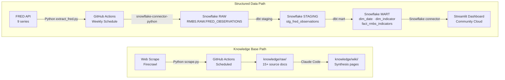

# RMBS Market Intelligence Dashboard

An end-to-end analytics pipeline tracking residential mortgage-backed securities (RMBS) market indicators — mortgage rates, delinquency rates, housing starts, and home price indices — sourced from the Federal Reserve FRED API, transformed via dbt in Snowflake, and surfaced through a Streamlit dashboard.

**Target Role:** Trading Analyst, Asset-Backed Finance (Apollo Global Management)

## Pipeline Diagram



## Tech Stack

| Layer | Tool |
|-------|------|
| Data Warehouse | Snowflake (AWS US East 1) |
| Transformation | dbt |
| Orchestration | GitHub Actions (weekly) |
| Dashboard | Streamlit (Community Cloud) |
| API Source | FRED (Federal Reserve Economic Data) |
| Web Scrape | Firecrawl |
| Knowledge Base | Claude Code |

## Data Sources

**Source 1 — FRED API** (9 series, 2000–present):

| Series | Description | Frequency |
|--------|-------------|-----------|
| MORTGAGE30US | 30-Year Fixed Rate Mortgage Average | Weekly |
| MORTGAGE15US | 15-Year Fixed Rate Mortgage Average | Weekly |
| MORTGAGE5US | 5/1-Year ARM Average | Weekly |
| DRSFRMACBS | Delinquency Rate on Single-Family Residential Mortgages | Quarterly |
| DRSREACBS | Delinquency Rate on Real Estate Loans | Quarterly |
| HOUST | Housing Starts: Total New Privately-Owned Units | Monthly |
| PERMIT | New Private Housing Units Authorized by Building Permits | Monthly |
| CSUSHPISA | S&P/Case-Shiller U.S. National Home Price Index | Monthly |
| USSTHPI | All-Transactions House Price Index for the United States | Quarterly |

**Source 2 — Web Scrape** (knowledge base): Apollo research, SIFMA reports, housing finance publications via Firecrawl.

## Star Schema (ERD)

```
RMBS.MART
├── dim_date          (full_date PK, year, quarter, month, month_name, day, ...)
├── dim_indicator     (series_id PK, name, category, unit, frequency)
└── fact_rmbs_indicators
        ├── observation_date  → dim_date.full_date
        ├── series_id         → dim_indicator.series_id
        └── value
```

## Setup

### Prerequisites

- Python 3.11+
- Snowflake trial account (AWS US East 1)
- FRED API key (fred.stlouisfed.org)

### Environment Variables

Create a `.env` file (never committed):

```
FRED_API_KEY=your_key
SNOWFLAKE_ACCOUNT=your_account
SNOWFLAKE_USER=your_user
SNOWFLAKE_PASSWORD=your_password
SNOWFLAKE_ROLE=ACCOUNTADMIN
SNOWFLAKE_WAREHOUSE=COMPUTE_WH
SNOWFLAKE_DATABASE=RMBS
SNOWFLAKE_SCHEMA=RAW
```

### Run Locally

```bash
# Install dependencies
pip install -r requirements.txt

# Extract FRED data → Snowflake RAW
python pipeline/extract_fred.py

# Load env vars for dbt (Windows)
set -a && source .env && set +a

# Run dbt transformations
cd dbt
dbt run --profiles-dir .
dbt test --profiles-dir .
```

### GitHub Actions Secrets

Add these secrets to your repo under **Settings → Secrets → Actions**:

- `FRED_API_KEY`
- `SNOWFLAKE_ACCOUNT`
- `SNOWFLAKE_USER`
- `SNOWFLAKE_PASSWORD`
- `SNOWFLAKE_ROLE`
- `SNOWFLAKE_WAREHOUSE`
- `SNOWFLAKE_DATABASE`

## Knowledge Base

Query the knowledge base via Claude Code:

```
"What does my knowledge base say about Non-QM loan performance trends?"
"What is Apollo's stated strategy for the ABF platform?"
"What does my knowledge base say about the current rate environment's impact on RMBS?"
```

Claude Code reads `knowledge/wiki/` pages synthesized from `knowledge/raw/` sources to answer.
